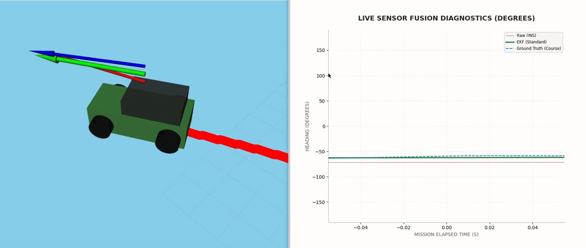
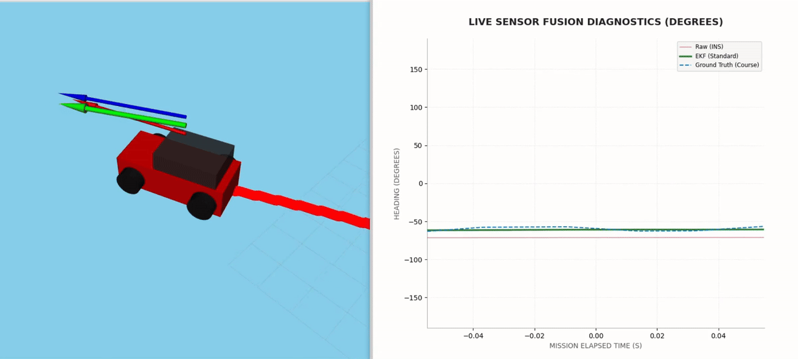
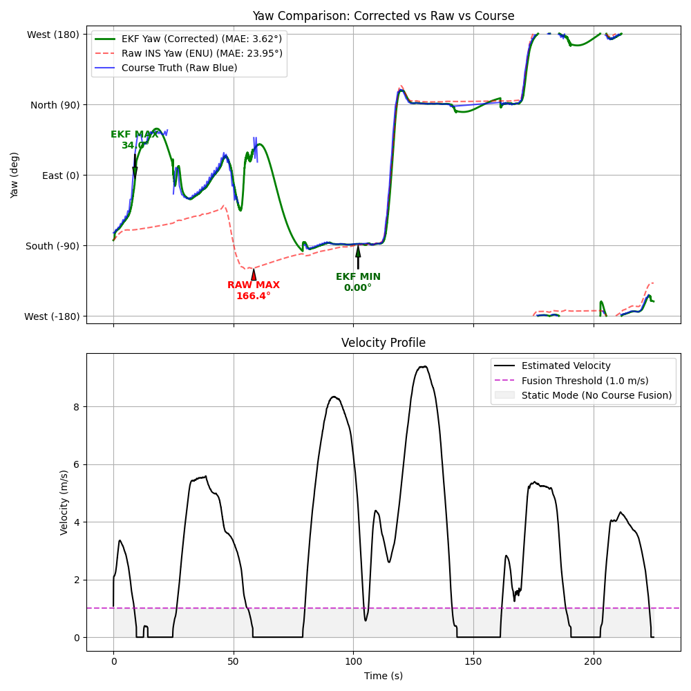
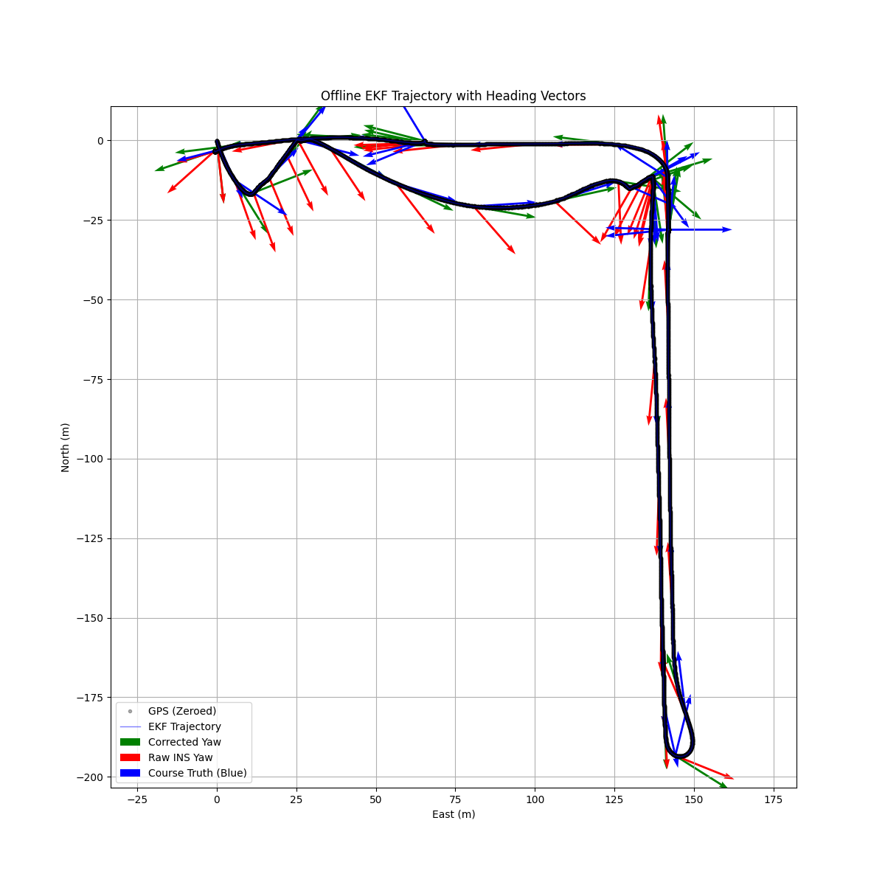

<div align="center">

# AGC-MOTE: Real-Time Yaw Drift Correction for Ground Vehicles

An Extended Kalman Filter that learns and removes hidden IMU bias in real-time, turning drifting sensor data into accurate heading estimates.

[](http://wiki.ros.org/noetic)
[](https://www.python.org/downloads/)
[](https://www.docker.com/)
[](#ekf-convergence-after-correction)
[](LICENSE)



Green = EKF-corrected heading | Red = raw INS heading (drifting) | Blue = GPS course truth

</div>

---

## IMU Yaw Drift: Before Correction

Low-cost IMUs accumulate angular velocity bias over time. A tiny constant gyro error (e.g. 0.1 deg/s) compounds into massive heading errors over minutes, causing dead-reckoned trajectories to spiral away from reality.

<p align="center">
  
</p>

<p align="center"><em>The red arrow shows where the IMU thinks the vehicle is pointing — wrong by up to 166 degrees over a 4-minute drive.</em></p>

## EKF Convergence: After Correction

The 7-state EKF models sensor bias as a hidden state variable, fusing GPS position, IMU heading, wheel velocity, and geometric course-over-ground to learn and subtract the bias in real-time.

| State | What it represents | Why it matters |
|-------|-------------------|----------------|
| `x, y` | Position (UTM, meters) | GPS-corrected vehicle location |
| `v` | Linear velocity | Wheel odometry + acceleration model |
| `theta` | True heading (ENU) | Corrected direction the vehicle is actually facing |
| `yaw_rate_bias` | Gyro drift rate | Hidden error in angular velocity, removed every prediction step |
| `heading_bias` | Absolute sensor offset | Constant offset between IMU reading and true north |
| `acceleration` | Linear acceleration (damped) | Smooths velocity transitions, prevents jitter at stops/starts |

3.6 deg mean absolute error (EKF) vs 24.0 deg MAE (raw IMU) — a 6.6x improvement.

<p align="center">
  
  
</p>

<p align="center"><em>Left: Heading over time — green (EKF) tracks blue (GPS truth) while red (raw IMU) drifts. Right: Bird's-eye trajectory with heading arrows.</em></p>

---

## Quick Start

### Prerequisites
- Docker Desktop with WSL integration enabled
- X server for GUI (VcXsrv/Xming on Windows, or native on Linux)

### Build
```bash
git clone git@github.com:isabelmoore/mote_ros.git
cd mote_ros
docker compose build
```

### Run

tmux launcher (processing + RViz in separate windows):
```bash
./run_in_tmux.sh
```

Manual (two terminals):
```bash
# Terminal 1: EKF + bag playback
docker compose run --rm mote_ros /bin/bash -c \
  "source devel/setup.bash && roslaunch mote_ros run_both_nodes.launch"

# Terminal 2: RViz visualization
docker compose run --rm mote_ros /bin/bash -c \
  "source devel/setup.bash && rviz -d /root/catkin_ws/src/AGC-MOTE-Monte-Carlo/src/mote_ros/rviz/visualization.rviz"
```

Offline analysis (no GUI):
```bash
docker compose run --rm mote_ros /bin/bash -c \
  "python3 src/AGC-MOTE-Monte-Carlo/scripts/analyze_bag_data.py && \
   python3 src/AGC-MOTE-Monte-Carlo/scripts/animate_trajectory.py"
```

### Verify Topics
```bash
docker compose exec mote_ros bash -c "source devel/setup.bash && rostopic list"
```

---

## Project Structure

```
src/mote_ros/
  kalman_filter/
    kalman_filter.py          # 7-state EKF core algorithm
    kalman_filter_node.py     # ROS node: subscribes to INS/twist, runs EKF
    visualization_node.py     # ROS node: publishes markers + TF to RViz
  msg/
    State.msg                 # EKF output: pos, vel, yaw, biases, accel
  launch/
    run_both_nodes.launch     # Main launch: EKF + viz + bag player
  urdf/
    vehicle.urdf              # Jeep 3D model for RViz
  rviz/
    visualization.rviz        # RViz display config

scripts/
  analyze_bag_data.py         # Offline bag processing
  animate_trajectory.py       # Generate trajectory GIF from results

*.bag                         # Recorded Jeep IMU/GPS data
```

---

## How It Works

Full mathematical formulation (state prediction, Jacobian, measurement models, particle filter) in [PROJECT_OVERVIEW.md](PROJECT_OVERVIEW.md).

The EKF models the IMU's yaw reading as `theta_true + heading_bias` and the gyro reading as `omega_true + rate_bias`. Both biases are estimated as slowly-varying hidden states. GPS course-over-ground corrections allow the filter to converge on the true bias values, auto-calibrating the sensor over time.

Tuning levers (in `kalman_filter_node.py`):
- `R_pos` — GPS position trust (higher = smoother, slower to correct)
- `R_yaw` — INS heading trust
- `Q[3,3]` — Heading process noise (lower = more inertia)
- `Q[4,4]` / `Q[5,5]` — How fast biases can change (very low = stable bias assumption)
- `course_fusion_trust` — Weight given to GPS geometric heading

---

## Bag Data

Three recorded drives from a Jeep with VectorNav INS + wheel odometry:

| File | Duration | Description |
|------|----------|-------------|
| `jeep_loca_pos_...-19-36-33.bag` | ~1 min | Short calibration run |
| `jeep_loca_pos_...-19-40-51.bag` | ~4 min | Main test drive (default) |
| `jeep_lostandstill_...-19-45-01.bag` | ~4 min | Stationary + lost GPS test |

Topics: `/vectornav/INS` (lat, lon, yaw, velocity, uncertainty) and `/vehicle/twist` (linear/angular velocity).
